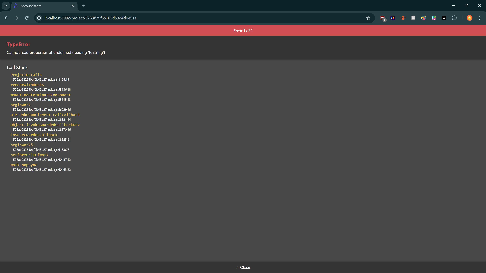
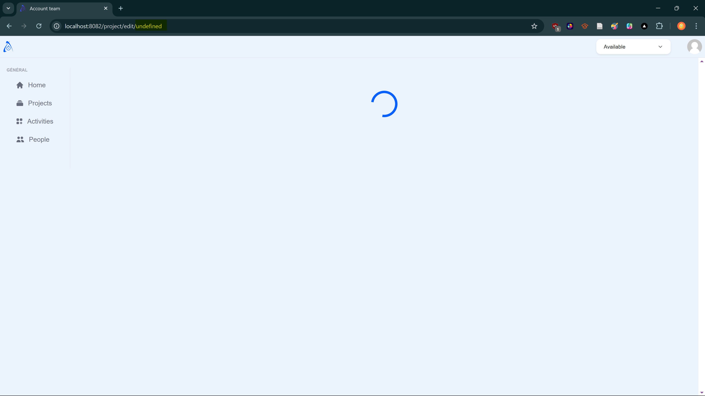
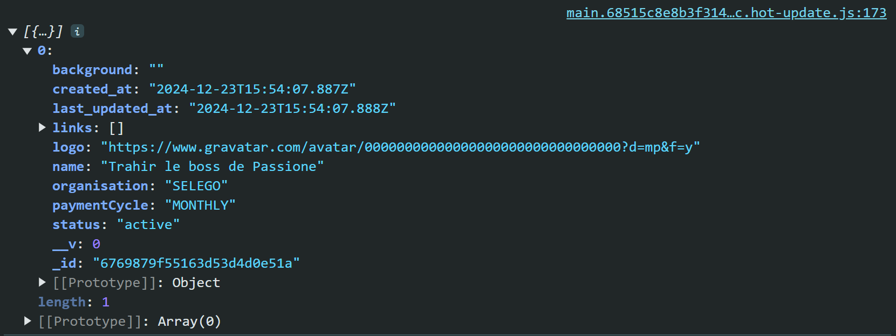
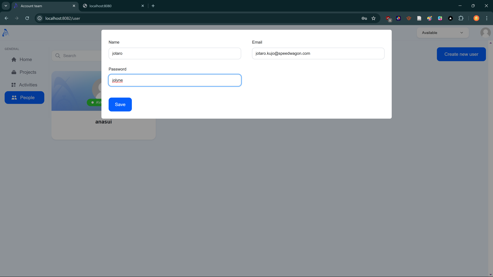
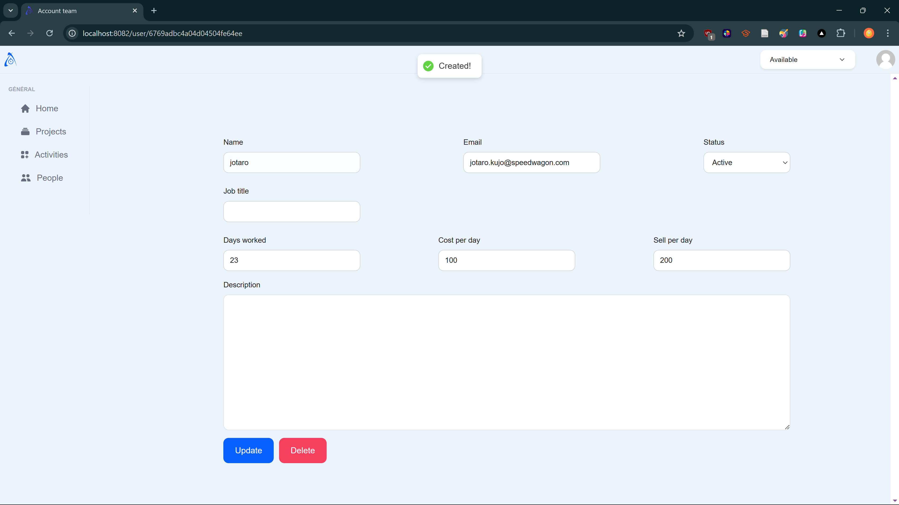
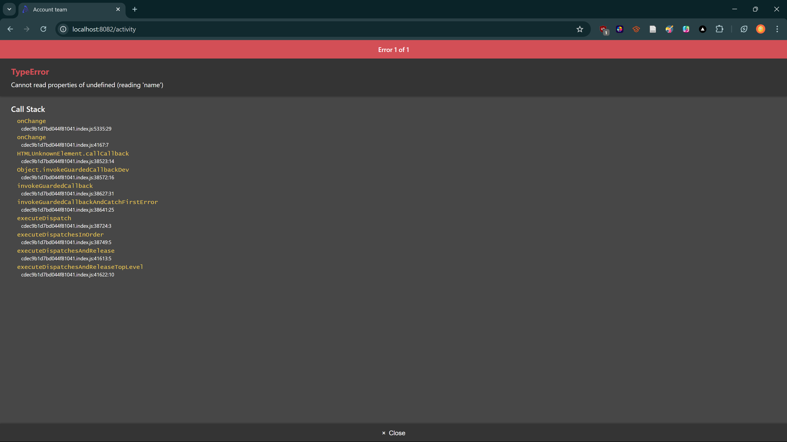
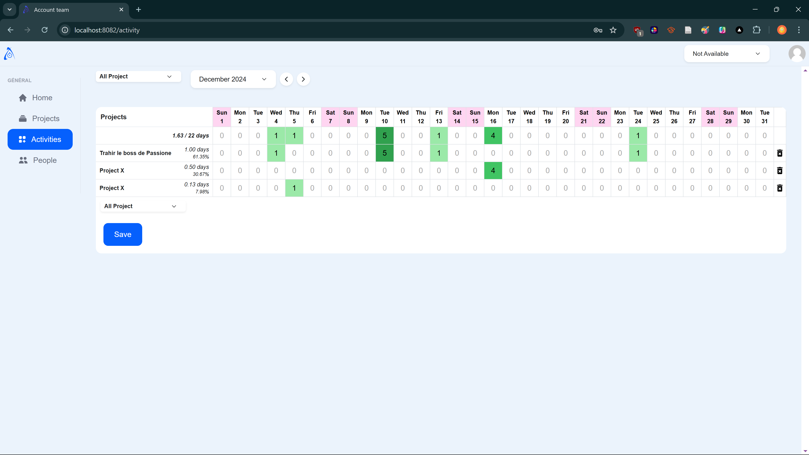
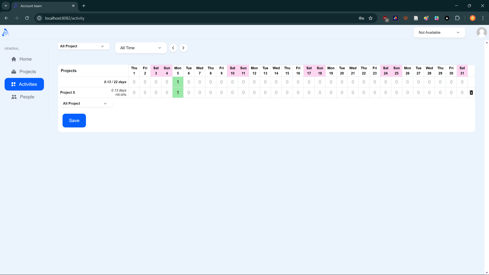

# Technical test

## Introduction

Fabien just came back from a meeting with an incubator and told them we have a platform “up and running” to monitor people's activities and control the budget for their startups !

All others developers are busy and we need you to deliver the app for tomorrow.
Some bugs are left and we need you to fix those. Don't spend to much time on it.

We need you to follow these steps to understand the app and to fix the bug :

- Sign up to the app
- Create at least 2 others users on people page ( not with signup )
- Edit these profiles and add aditional information
- Create a project
- Input some information about the project
- Input some activities to track your work in the good project

Then, see what happens in the app and fix the bug you found doing that.

## Then

Time to be creative, and efficient. Do what you think would be the best for your product under a short period.

### The goal is to fix at least 3 bugs and implement 1 quick win feature than could help us sell the platform

## Setup api

- cd api
- Run `npm i`
- Run `npm run dev`

## Setup app

- cd app
- Run `npm i`
- Run `npm run dev`

## Finally

Send us the project and answer to those simple questions :

- What bugs did you find ? How did you solve these and why ?
- Which feature did you develop and why ?
- Do you have any feedback about the code / architecture of the project and what was the difficulty you encountered while doing it ?

## Submission

### Fixed Bugs

#### 1. Display the Project's Name & Edit Project

When clicking on the project this screen got displayed suddenly:

Also when clicking on the "Edit" button, the page kept loading indefinitely as no project ID was passed to the URL, as seen in the picture below:

In `app\src\scenes\project\view.js`, `console.log(project)` shows that the returned `project` is an array such as the following:

So, the `project` which name we want to display is the first element of said array but, as an ID is unique, it is more relevant to return **a single object** instead of a whole array.\
So in `api\src\controllers\project.js`, the call to the MongoDB database to fetch a `Project` with its `id` should be done this way:

```javascript
// const data = await ProjectObject.find({ _id: req.params.id });
const data = await ProjectObject.findOne({ _id: req.params.id });
```

#### 2. Display Name for Newly Created Users

It is actually the first bug that occured to me when I was asked to create two users from the "People" tab, it frustated me that the name did not come through.



After browsing through the [Formik's documentation](https://formik.org/docs/api/formik#onsubmit-values-values-formikbag-formikbag--void--promiseany), it turns out that the `name` attribute of the `input` tags are used as keys in the returned `values`. So, for the chosen user's name to come through, the `name` attribute should be `name` and not `username`, to fit the `name` attribute in a `User` object:

```javascript
{
	/* <input className="projectsInput text-[14px] font-normal text-[#212325] rounded-[10px]" name="username" value={values.username} onChange={handleChange} /> */
}
<input
	className="projectsInput text-[14px] font-normal text-[#212325] rounded-[10px]"
	name="name"
	value={values.name}
	onChange={handleChange}
/>;
```

_(changes in `app\src\scenes\user\list.js`)_



#### 3. Handle Undefined Project in `SelectProject` Component

When interacting with the `SelectProject` component, a `TypeError` occurred if the selected project was not found in the list of projects.



To solve this issue, I updated the `onChange` function in `app\src\components\selectProject.js` to ensure that the project is found before trying to access its properties:

```javascript
onChange={(e) => {
	e.preventDefault();
	const f = projects.find((f) => e.target.value === f.name);
	if (f) {
	onChange(f);
	} else {
	onChange({ name: "" }); // Handle case where project is not found
	}
}}
```

#### 4. Show only Current User's Activities

When a project has activities logged by different users, all activities could be edited by a user, which is not optimal security-wise.


So I found it quite important to solve this issue. The problem was with the parameters given to the API URL, the expected parameter was `userId` but `user` was used, and same for the filtering option for the MongoDB collection. These mishaps caused the returned data to not be filtered by the current user at all, so all the activites were returned instead of only the ones related to the user.

_change in `api\src\controllers\activity.js`_

```javascript
// if (req.query.userId) query.user = req.query.userId;
if (req.query.userId) query.userId = req.query.userId;
```

\
_change in `app\src\components\selectProject.js`_\
To use the project's ID instead of its name in the API URL

```js
// const f = projects.find((f) => e.target.value === f.name);
const f = projects.find((f) => e.target.value === f._id);

.map((e) => { // From line 41
	return (
		<option key={e._id} value={e._id}>
		{e.name}
		</option>
	);
})
```

_changes in `app\src\scenes\activity\index.js`_\
Other changes were made in this file to deal with the selection of the date range.

```js
// const { data } = await api.get(`/activity?date=${date.getTime()}&user=${user.name}&project=${project}`);
const { data } = await api.get(
	`/activity?dateFrom=${date.getTime()}${
		dateTo ? `&dateTo=${dateTo}` : ""
	}&userId=${user._id}${project ? `&projectId=${project}` : ""}`
);
```

Now, only the current user's activities are editable. To see the overall progress of a project, it is still possible in the "Projects" tab.


### Added Functionality
